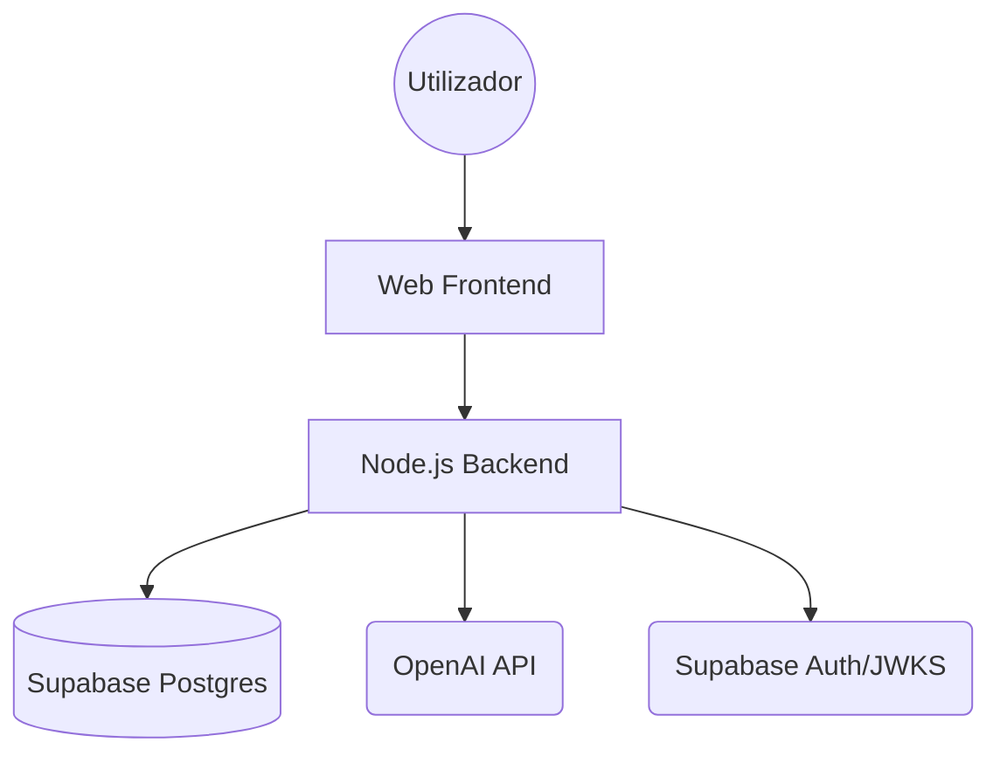

# Topologia de Deploy e Promoção — ablute_ wellness

Este documento define a arquitetura de ambientes e o fluxo de promoção de código para garantir estabilidade e segurança.

## 1. Topologia de Deploy

A plataforma é composta por três camadas principais:

## 2. Matriz de Ambientes

| Funcionalidade | Local | Preview (Staging) | Produção |
| :--- | :--- | :--- | :--- |
| **Frontend Host** | localhost:8081 | Vercel / Netlify (Preview) | Dominio Oficial |
| **Backend Host** | localhost:3000 | Railway / Heroku (Preview) | Cluster Produção |
| **CORS Policy** | Explicit List: localhost | Regex: `.*\.vercel\.app$` | **Explicit List Only** |
| **Auth** | Supabase Project A | Supabase Project A | **Supabase Project B (Prod)** |
| **Fail-Fast** | Enabled (Logs) | Enabled (Exit 1) | **Enabled (Exit 1)** |

## 3. Lógica de Resolução Frontend ↔ Backend

A resolução da URL do backend no frontend segue um contrato rigoroso definido em `src/config/env.ts`:

1. **Local**: Se `EXPO_PUBLIC_BACKEND_URL` não estiver definido, assume `http://localhost:3000`.
2. **Preview**: Deve receber `EXPO_PUBLIC_BACKEND_URL` dinâmico da plataforma de deploy.
3. **Produção**: Se `NODE_ENV=production` e a URL estiver em falta, a App **lança erro fatal e não arranca**.

## 4. Checklist de Promoção (Staging → Prod)

Antes de promover uma versão para produção, seguir obrigatoriamente:

1. [ ] **Validar Readiness**: Aceder a `GET /health/ready` no ambiente de Staging e confirmar que todos os checks (DB, OpenAI, Supabase) estão `ok`.
2. [ ] **Smoke Test**: Executar `node backend/scratch/smoke_test_m6.js --url <STAGING_URL> --token <TEST_TOKEN>`.
3. [ ] **Audit CORS**: Garantir que as origens de produção estão listadas no backend.
4. [ ] **Configuração Prod**: Verificar se os segredos de Produção (BD Real, OpenAI Key de Prod) estão carregados no dashboard do host.
5. [ ] **Deploy**: Acionar o merge/deploy.

## 5. Checklist de Rollback Mínimo

Em caso de falha crítica pós-deploy:

1. **Identificar**: Confirmar falha via `/health/ready`.
2. **Reverter Backend**: Fazer redeploy do commit/tag anterior estável.
3. **Reverter Frontend**: Reverter para o build estável anterior.
4. **Validar**: Executar Smoke Test no ambiente revertido.
5. **Post-Mortem**: Documentar a causa no canal de operações.
